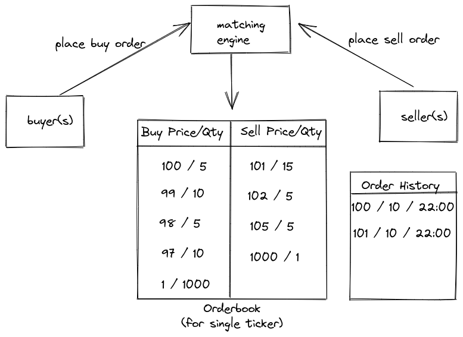

# Problem Statement
- Design a stock engine

## Requirements
Functional 
- <>
### Extensions
- <>
### NFR
- <>
## Interface
```lang
```


## System Design
### HLD


## Resources
- https://around25.com/blog/building-a-trading-engine-for-a-crypto-exchange/